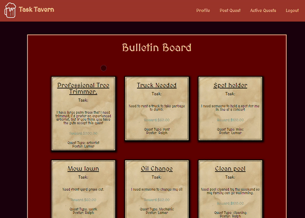

# Project # 2 Task Tavern

## Description

We created an app that allows users to post requests or take on other users request to capitalize on the booming gig economy. As a User you can create an account and start posting requests which we will call Quests. A quest can be any form of task from menial labor to skilled professional. The user can set the price or reward for the Quest and other users can choose to accept the quest. Quest Takers can take on any number of quests which are then placed on their account. Upon completion a user will earn points that will accrue where they can earn badges to show off their expertise.

## Tasks

- Created Models for the User, Quest, and Badges
- Created api and home routes for each Model type.
- Built associations between the various models and used the data to populate handlebars views.
- Created views that display user, quest, and badge data. The various pages interact with eachother and are responsive.
- Created a navbar that allows the user to easily navigate the page for a better UX/UI experience.

## Usage

## Links

GitHub Repo Page: https://github.com/rambriz91/task-tavern
https://task-tavern-aa826bd56c1c.herokuapp.com/login

## Credits

https://www.npmjs.com/package/sequelize
https://handlebarsjs.com/

## License

MIT License

Copyright (c) [2023] [Robert Ambriz, Jorge Gonzalez, Lamar Reliford, Raphael Ortiz]

Permission is hereby granted, free of charge, to any person obtaining a copy
of this software and associated documentation files (the "Software"), to deal
in the Software without restriction, including without limitation the rights
to use, copy, modify, merge, publish, distribute, sublicense, and/or sell
copies of the Software, and to permit persons to whom the Software is
furnished to do so, subject to the following conditions:

The above copyright notice and this permission notice shall be included in all
copies or substantial portions of the Software.

THE SOFTWARE IS PROVIDED "AS IS", WITHOUT WARRANTY OF ANY KIND, EXPRESS OR
IMPLIED, INCLUDING BUT NOT LIMITED TO THE WARRANTIES OF MERCHANTABILITY,
FITNESS FOR A PARTICULAR PURPOSE AND NONINFRINGEMENT. IN NO EVENT SHALL THE
AUTHORS OR COPYRIGHT HOLDERS BE LIABLE FOR ANY CLAIM, DAMAGES OR OTHER
LIABILITY, WHETHER IN AN ACTION OF CONTRACT, TORT OR OTHERWISE, ARISING FROM,
OUT OF OR IN CONNECTION WITH THE SOFTWARE OR THE USE OR OTHER DEALINGS IN THE
SOFTWARE.
